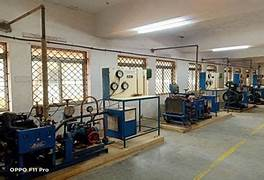

index.html

```
<!DOCTYPE html>
<html lang="en">
<head>
    <meta charset="UTF-8">
    <meta name="viewport" content="width=device-width, initial-scale=1.0">
    <title>SAVEETHA ENGINEERING COLLEGEe</title>
    <link rel="stylesheet">
</head>
<body >

<header>
    
    <h1>Saveetha Engineering College</h1>
</header>

<nav>
    <a href="index.html">Home</a>
    <a href="academics.html">Academics</a>
    <a href="admission.html">Admission</a>
    <a href="gallery.html">Gallery</a>
</nav>

<article>
    <h2>Welcome to Saveetha Engineering College</h2>
    <p>Saveetha Engineering College is a prestigious institution .</p>
<article>

<footer>
    &copy; 2024 SEC College. All rights reserved.
</footer>

</body>
</html>
```

Academics.html:

```
<!DOCTYPE html>
<html>
<head>
    <title>Academics - Saveetha Engineering College</title>
    <meta charset="UTF-8">
    <link rel="stylesheet">
</head>
<body>
    <header>
        
        <h1>Saveetha Engineering College</h1>
        <nav>
            <a href="index.html">Home</a>
            <a href="academics.html">Academics</a>
            <a href="admission.html">Admission</a>
            <a href="gallery.html">Gallery</a>
        </nav>
    </header>
    <main>
        <h2>Academics</h2>
        <ul>
            <li>Science
                <ul>
                    <li><a href="courses/cs.html">Computer Science</a></li>
                    <li><a href="courses/maths.html">Mathematics</a></li>
                </ul>
            </li>
            <li>Arts
                <ul>
                    <li><a href="courses/english.html">English</a></li>
                    <li><a href="courses/sociology.html">Sociology</a></li>
                </ul>
            </li>
            <li>Commerce
                <ul>
                    <li><a href="courses/economics.html">Economics</a></li>
                    <li><a href="courses/business-management.html">Business Management</a></li>
                </ul>
            </li>
        </ul>
    </main>
    <footer>
        &copy; 2024 SEC. All rights reserved.
    </footer>
</body>
</html>
```

Admission.html

```
<!DOCTYPE html>
<html>
<head>
    <title>Admission - Saveetha Engineering College</title>
    <meta charset="UTF-8">
    <link rel="stylesheet" href="styles.css">
</head>
<body>
    <header>
        
        <h1>ABC College</h1>
        <nav>
            <a href="index.html">Home</a>
            <a href="academics.html">Academics</a>
            <a href="admission.html">Admission</a>
            <a href="gallery.html">Gallery</a>
        </nav>
    </header>
    <main>
        <h2>Admission Form</h2>
        <form>
            <label for="name">Name:</label>
            <input type="text" id="name" name="name"><br><br>

            <label for="email">Email:</label>
            <input type="email" id="email" name="email"><br><br>

            <label for="phone">Phone:</label>
            <input type="tel" id="phone" name="phone"><br><br>

            <label for="department">Department:</label>
            <select id="department" name="department">
                <option value="science">Science</option>
                <option value="arts">Arts</option>
                <option value="commerce">Commerce</option>
            </select><br><br>

            <label for="course">Course:</label>
            <select id="course" name="course">
                <option value="computer-science">Computer Science</option>
                <option value="mathematics">Mathematics</option>
                <option value="english">English</option>
                <option value="sociology">Sociology</option>
                <option value="economics">Economics</option>
                <option value="business-management">Business Management</option>
            </select><br><br>

            <input type="submit" value="Submit">
        </form>
    </main>
</body>
</html>
```

gallery.html

```<!DOCTYPE html>
<html>
<head>
    <title>Gallery - Saveetha Engineering College</title>
    <meta charset="UTF-8">
    <link rel="stylesheet">
</head>
<body>
    <header>
        
        <h1>Saveetha Engineering College</h1>
        <nav>
            <a href="index.html">Home</a>
            <a href="academics.html">Academics</a>
            <a href="admission.html">Admission</a>
            <a href="gallery.html">Gallery</a>
        </nav>
    </header>
    <main>
        <h2>Gallery</h2>
        
        
        
    </main>
    <footer>
        &copy; 2024 SEC. All rights reserved.
    </footer>
</body>
</html>
```

business-management.html

```
<!DOCTYPE html>
<html lang="en">
<head>
    <meta charset="UTF-8">
    <meta name="viewport" content="width=device-width, initial-scale=1.0">
    <title>Saveetha Engineering College</title>
    <link rel="stylesheet">
</head>
<body>

<header>
    
    <h1>Saveetha Engineering College</h1>
</header>

<nav>
    <a href="index.html">Home</a>
    <a href="academics.html">Academics</a>
    <a href="admission.html">Admission</a>
    <a href="gallery.html">Gallery</a>
</nav>

<main>
    <h2>Business Management</h2>
    <p>Business management involves the planning, coordination, and execution of business activities to achieve specific goals and objectives. It encompasses a wide range of functions and disciplines aimed at efficiently using resources to produce goods or services and deliver value to customers. </p>

    <h3>Faculty</h3>
    <ul>
        <li>Dr. Paul Ahmed</li>
        <li>Prof. Michael Clarke</li>
        <li>Dr. David Johnson</li>
    </ul>

    <h3>Timetable</h3>
    <table>
        <tr>
            <th>Day</th>
            <th>Time</th>
            <th>Course</th>
        </tr>
        <tr>
            <td>Tuesday</td>
            <td>11:00 AM - 1:00 PM</td>
            <td>Principles of Management</td>
        </tr>
        <tr>
            <td>Thursday</td>
            <td>3:00 PM - 5:00 PM</td>
            <td>Marketing Fundamentals</td>
        </tr>
        <tr>
            <td>Friday</td>
            <td>9:00 AM - 11:00 AM</td>
            <td>Financial Accounting</td>
        </tr>
    </table>
</main>


<footer>
    &copy; 2024 SEC. All rights reserved.
</footer>

</body>
</html>
```

cs.html

```
<!DOCTYPE html>
<html lang="en">
<head>
    <meta charset="UTF-8">
    <meta name="viewport" content="width=device-width, initial-scale=1.0">
    <title>Saveetha Engineering College</title>
    <link rel="stylesheet">
</head>
<body>

<header>
    
    <h1>Saveetha Engineering College</h1>
</header>

<nav>
    <a href="index.html">Home</a>
    <a href="academics.html">Academics</a>
    <a href="admission.html">Admission</a>
    <a href="gallery.html">Gallery</a>
</nav>

<main>
    <h2>Computer Science</h2>
    <p>Computer science is the study of computers and computational systems. It encompasses both the theoretical and practical aspects of computing, from the fundamental principles of algorithms and data structures to the design and implementation of hardware and software.</p>

    <h3>Faculty</h3>
    <ul>
        <li>Dr. John Joel</li>
        <li>Prof. Steve smith</li>
        <li>Dr. Ilavarasan</li>
    </ul>

    <h3>Timetable</h3>
    <table>
        <tr>
            <th>Day</th>
            <th>Time</th>
            <th>Course</th>
        </tr>
        <tr>
            <td>Monday</td>
            <td>10:00 AM - 12:00 PM</td>
            <td>Introduction to Programming</td>
        </tr>
        <tr>
            <td>Wednesday</td>
            <td>2:00 PM - 4:00 PM</td>
            <td>Data Structures</td>
        </tr>
        <tr>
            <td>Friday</td>
            <td>11:00 AM - 1:00 PM</td>
            <td>Computer Systems</td>
        </tr>
    </table>
</main>


<footer>
    &copy; 2024 SEC. All rights reserved.
</footer>

</body>
</html>
```

economics.html

```
<!DOCTYPE html>
<html lang="en">
<head>
    <meta charset="UTF-8">
    <meta name="viewport" content="width=device-width, initial-scale=1.0">
    <title>Saveetha Engineering College</title>
    <link rel="stylesheet">
</head>
<body>

<header>
    
    <h1>Saveetha Engineering College</h1>
</header>

<nav>
    <a href="index.html">Home</a>
    <a href="academics.html">Academics</a>
    <a href="admission.html">Admission</a>
    <a href="gallery.html">Gallery</a>
</nav>

<main>
    <h2>Economics</h2>
    <p>The Economics program offers a thorough understanding of economic theory, policy, and analysis. Students will study microeconomics, macroeconomics, econometrics, and international economics, equipping them with skills for careers in finance, government, and academia.</p>

    <h3>Faculty</h3>
    <ul>
        <li>Dr.Smith</li>
        <li>Prof. David Raja</li>
        <li>Dr. DavidMiller</li>
    </ul>

    <h3>Timetable</h3>
    <table>
        <tr>
            <th>Day</th>
            <th>Time</th>
            <th>Course</th>
        </tr>
        <tr>
            <td>Monday</td>
            <td>9:00 AM - 11:00 AM</td>
            <td>Microeconomics</td>
        </tr>
        <tr>
            <td>Wednesday</td>
            <td>1:00 PM - 3:00 PM</td>
            <td>Macroeconomics</td>
        </tr>
        <tr>
            <td>Friday</td>
            <td>2:00 PM - 4:00 PM</td>
            <td>Econometrics</td>
        </tr>
    </table>
</main>


<footer>
    &copy; 2024 SEC. All rights reserved.
</footer>

</body>
</html>
```

maths.html

```
<!DOCTYPE html>
<html lang="en">
<head>
    <meta charset="UTF-8">
    <meta name="viewport" content="width=device-width, initial-scale=1.0">
    <title>Saveetha Engineering College</title>
    <link rel="stylesheet">
</head>
<body>

<header>
    
    <h1>Saveetha Engineering College</h1>
</header>

<nav>
    <a href="index.html">Home</a>
    <a href="academics.html">Academics</a>
    <a href="admission.html">Admission</a>
    <a href="gallery.html">Gallery</a>
</nav>

<main>
    <h2>Mathematics</h2>
    <p>Mathematics, often referred to as "math" or "maths," is a vast and multifaceted field of study that deals with numbers, quantities, shapes, structures, and their relationships and properties. It is both an abstract science and a practical tool used in many areas of life and various fields of study</p>

    <h3>Faculty</h3>
    <ul>
        <li>Dr.Mary</li>
        <li>Prof. Bob Alice</li>
        <li>Dr. Johnson</li>
    </ul>

    <h3>Timetable</h3>
    <table>
        <tr>
            <th>Day</th>
            <th>Time</th>
            <th>Course</th>
        </tr>
        <tr>
            <td>Tuesday</td>
            <td>9:00 AM - 11:00 AM</td>
            <td>Calculus and Matrix</td>
        </tr>
        <tr>
            <td>Thursday</td>
            <td>1:00 PM - 3:00 PM</td>
            <td>Algebra</td>
        </tr>
        <tr>
            <td>Friday</td>
            <td>3:00 PM - 5:00 PM</td>
            <td>Statistics</td>
        </tr>
    </table>
</main>


<footer>
    &copy; 2024 SEC. All rights reserved.
</footer>

</body>
</html>
```

sociology.html

```
<!DOCTYPE html>
<html lang="en">
<head>
    <meta charset="UTF-8">
    <meta name="viewport" content="width=device-width, initial-scale=1.0">
    <title>Saveetha Engineering College</title>
    <link rel="stylesheet">
</head>
<body>

<header>
    
    <h1>Saveetha Engineering College</h1>
</header>

<nav>
    <a href="index.html">Home</a>
    <a href="academics.html">Academics</a>
    <a href="admission.html">Admission</a>
    <a href="gallery.html">Gallery</a>
</nav>

<main>
    <h2>Sociology</h2>
    <p>The Sociology program examines human society, social behavior, and culture. Students will explore topics such as social theory, research methods, and contemporary social issues, preparing them for careers in social research, policy analysis, and community work.</p>

    <h3>Faculty</h3>
    <ul>
        <li>Dr. Richard</li>
        <li>Prof. Donald</li>
        <li>Dr. Mitchell Starc</li>
    </ul>

    <h3>Timetable</h3>
    <table>
        <tr>
            <th>Day</th>
            <th>Time</th>
            <th>Course</th>
        </tr>
        <tr>
            <td>Tuesday</td>
            <td>10:00 AM - 12:00 PM</td>
            <td>Introduction to Sociology</td>
        </tr>
        <tr>
            <td>Thursday</td>
            <td>2:00 PM - 4:00 PM</td>
            <td>Social Theory</td>
        </tr>
        <tr>
            <td>Friday</td>
            <td>1:00 PM - 3:00 PM</td>
            <td>Contemporary Social Issues</td>
        </tr>
    </table>
</main>


<footer>
    &copy; 2024 SEC. All rights reserved.
</footer>

</body>
</html>
```

Output:

.png>)
 .png>) 
 .png>) 
 .png>)
